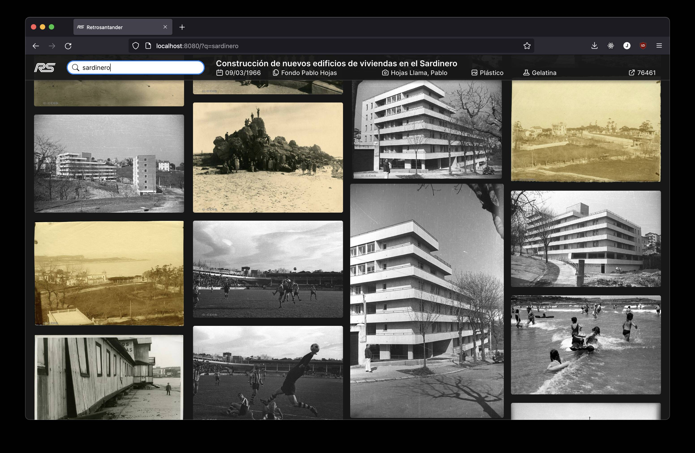
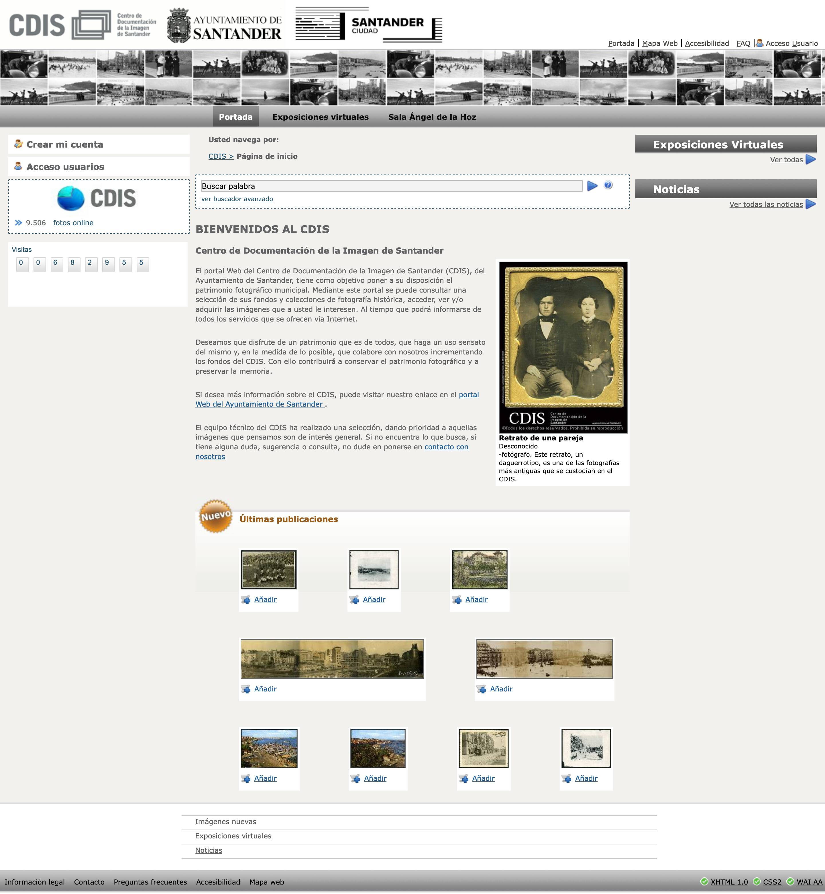
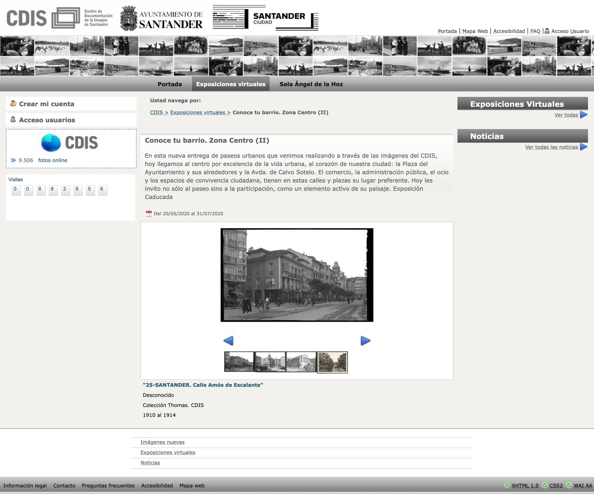
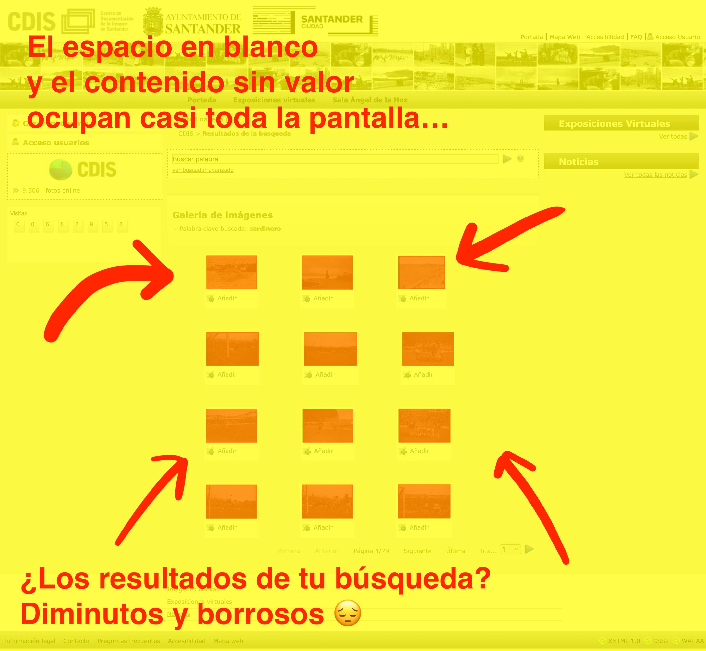
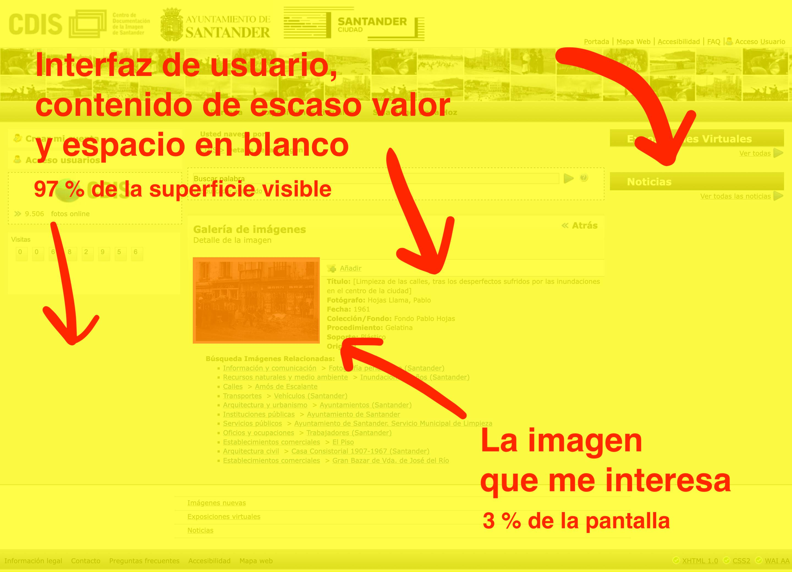
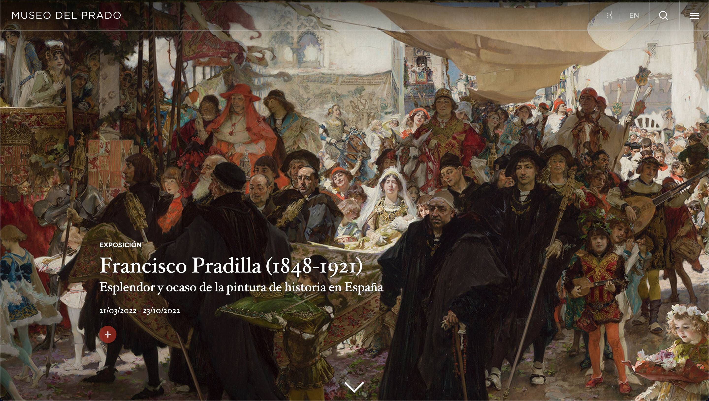
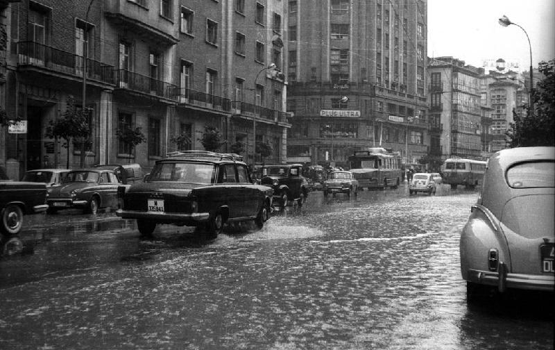
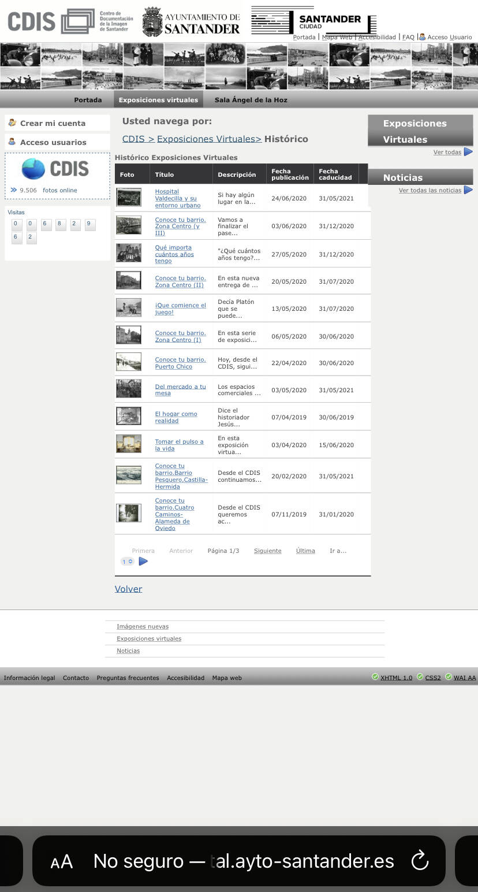
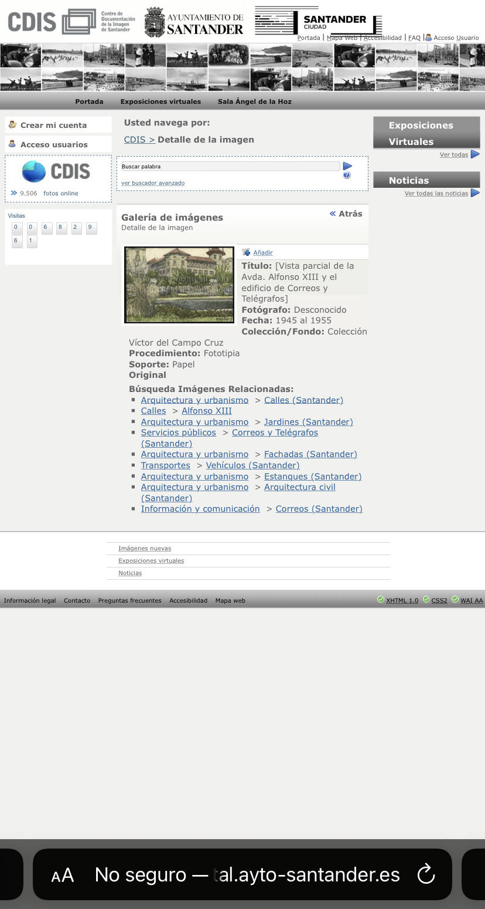
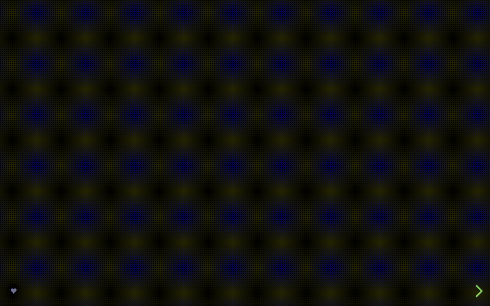

# El portal del CDIS

### ⚠️ **[ACTUALIZACIÓN] A raíz de esta iniciativa el Ayuntamiento de Santander [ha retirado el portal del CDIS](https://twitter.com/JaimeObregon/status/1523955161151983616).**

---

Un experimento personal con el portal del [Centro de Documentación de la Imagen de Santander](http://portal.ayto-santander.es/portalcdis/Index.do) (CDIS) y sus contenidos. Por [Jaime Gómez-Obregón](https://twitter.com/JaimeObregon).

[](https://retrosantander.com)

Prueba de concepto en [🔗 retrosantander.com](https://retrosantander.com). También [🎦 en vídeo](assets/retrosantander.mp4).

# El contexto

El Ayuntamiento de Santander opera el CDIS, una entidad **«que tiene como objetivo poner a su disposición el patrimonio fotográfico municipal»**, según su sitio web.

He llamado al CDIS para interesarme por ese patrimonio, y me han expresado que el canal habilitado para ello es **[el mencionado sitio web](http://portal.ayto-santander.es/portalcdis/Index.do)**. Las visitas al Centro son posibles, pero requieren de una **cita previa** y especificar con antelación sobre qué materiales se desea realizar la consulta, para que el equipo técnico del CDIS los prepare con antelación.

Puesto que mi interés no es académico ni historiográfico, sino la mera curiosidad abstracta, me veo con que el sitio web del CDIS es, esencialmente, mi única ventana al patrimonio fotográfico de la ciudad. Esto no sería inconveniente de no ser porque **el referido portal es muy mejorable**.

| La portada del CDIS                          | Vista de una imagen                             | Una exposición virtual                                           |
| -------------------------------------------- | ----------------------------------------------- | ---------------------------------------------------------------- |
|  |  |  |

# Por qué el portal del CDIS es muy mejorable

Como santanderino, **el fondo fotográfico del CDIS me parece un tesoro**. Sin embargo, se pone a disposición de la ciudadanía de una forma tosca y limitada. Esbozo a continuación mis porqués:

## 1. Por el diseño del sitio

Un sitio como el del CDIS debería reservar a la imagen un papel protagonista. Las fotografías deberían presidir absolutamente el sitio, como presiden los cuadros el sitio web del Museo del Prado. La atención del visitante debería dirigirse **a la contemplación de las imágenes**.

Sin embargo, el sitio del CDIS tiene un diseño que relega el tesoro a la última de las prioridades del escalafón de la atención del visitante. **Las imágenes no son el epicentro, sino que parecen un subproducto colateral**, un contenido secundario.

En mi portátil, las imágenes del CDIS representan **solo el 3 % de la superficie visible** de la pantalla, y en ocasiones por debajo del corte que obliga a hacer desplazamiento vertical.

| La experiencia de búsqueda en el CDIS                      | La ficha de una imagen                            |
| ---------------------------------------------------------- | ------------------------------------------------- |
|  |  |

Contrapongamos esta equivocada decisión con la maquetación elegida por el Museo del Prado para su sitio web: el museo **luce las obras en el centro de atención**. Las exhibe en toda su grandeza. Se recrea en ellas e invita a seguir explorándolas. Todo lo demás es accesorio y queda oculto tras una interfaz de usuario reducida a la mínima expresión.



**La navegación** por al colección fotográfica del CDIS también es tediosa. La retahíla de defectos y limitaciones es la tristemente habitual en cualquier sitio web promovido por organismos públicos. La omitiré aquí, para no hacer este resumen largo y penoso.

## 2. Por las marcas de agua

Antes de presentarlas al ciudadano, el CDIS sobreimprime **una enorme marca de agua** sobre las imágenes que atesora. Lejos de ser un discreto sello, es una monumental firma con las palabras «Centro de Documentación de la Imagen de Santander». Y ocupa de lado a lado el tercio central las imágenes.

**La marca de agua del CDIS es molesta.** Interfiere con la contemplación de las fotografías, que es la misión primordial del Centro, según su propio sitio web. En algunos casos, la marca de agua incluso dificulta la identificación de elementos esenciales de la escena.

Pero es que esta marca de agua <strong>además de molesta es también ineficaz</strong>, pues es posible eliminarla de cualquier imagen para dejar sin efecto la función denominativa y protectora que se le presume. Un poco más abajo explico cómo, a efectos únicamente pedagógicos.

| Con marca de agua                                   | Sin marca de agua                                     |
| --------------------------------------------------- | ----------------------------------------------------- |
|  |  |

## 3. Por el modelo de licenciamiento

Si el objetivo declarado del CDIS es «poner el patrimonio fotográfico municipal a disposición de» la ciudadanía, ¿por qué no se hace mediante un licenciamiento abierto y permisivo? Una licencia que permita y promueva una interacción sana de los usuarios con el contenido que se expone. Cada vez más organismos públicos se adhieren a licencias como [Creative Commons](https://creativecommons.org/licenses/?lang=es_ES). **El reconocimiento de los autores de las imágenes y el respeto a los derechos del CDIS no tiene por qué estar reñido con facilitar el acceso y promover la reutilización responsable** de una obra que sin usuarios pierde todo sentido.

El [aviso legal del CDIS](http://portal.ayto-santander.es/portalcdis/InfoLegal.do) es confuso en este sentido. Por una parte, hace una reserva expresa de todos los derechos y prohibe, entre otras cosas, **la copia, transmisión y difusión no autorizadas**. Pero hace una exención para un «uso personal» que no concreta:

> Todo material, marcas registradas u otras propiedades intelectuales de este website son propiedad de AYUNTAMIENTO DE SANTANDER o de sus compañías afiliadas, y están protegidas por los derechos de autor.
>
> Está permitida su reproducción para uso personal.
>
> Queda prohibida cualquier modificación, copia, alquiler, préstamo, trasmisión y difusión no autorizada. El material de este website no puede ser vendido ni distribuido de otra forma con ánimo de lucro.
>
> Todos los derechos Reservados.


Por otro lado, y sin embargo, el sitio web del CDIS ofrece al ciudadano la compra unitaria de imágenes, que son entregadas al comprador en un CD (!). Y especifica:

> A través del portal del CDIS sólo podrá descargar las imágenes que desee adquirir para uso privado o público sin ánimo de lucro en media resolución (JPG). Para la compra de imágenes en alta resolución (TIFF) o para uso público con ánimo de lucro, póngase en contacto con el CDIS.

Queda claro, pues, que es preciso comprar las imágenes para cualquier uso «privado o público sin ánimo de lucro». Algo que parece chocar con el permiso de reproducción «para uso personal» del aviso legal, si bien ni aquel texto ni este definen qué es un uso «personal» ni en qué difiere de un uso «privado».

## 4. Porque no está adaptado a móviles y no es seguro

El aviso legal del sitio web del CDIS data de 2008. Y aunque por aquel entonces ya eran habituales las tabletas y teléfonos, **el sitio web no está adaptado a estos dispositivos**.

| Las exposiciones, desde mi iPhone                                | La ficha de una imágen, desde el móvil                         |
| ---------------------------------------------------------------- | -------------------------------------------------------------- |
|  |  |

Y aunque el sitio tiene instalado un certificado criptográfico y ofrece la posibilidad de comunicaciones seguras, no está redireccionado correctamente. Esto hace que **el intercambio de información personal del ciudadano con el sitio**, por ejemplo para comprar imágenes, **no se realiza de forma segura**. He comprobado que los usuarios que acceden al CDIS desde una búsqueda en Google lo hacen por un canal inseguro:


# En resumen…

En definitiva, el sitio web del CDIS es el principal instrumento de la ciudadanía para acceder al patrimonio fotográfico de la ciudad de Santander, toda vez que las visitas al Centro requieren de solicitar una cita previa y anticipar un interés específico, tal y como me han expresado por teléfono.

Este sitio web es un desarrollo tosco, que proporciona al ciudadano un buscador limitado e ineficaz. Es probable que el propio personal técnico del Centro esté padeciendo igualmente las limitaciones de esta rudimentaria herramienta.

Y sin permiso previo no está permitido hacer con los recursos fotográficos del CDIS nada que no sea la mera consulta individual y doméstica a través de un canal web ineficiente.

**Si el fondo del CDIS es un tesoro de la ciudad, más que ponerse a disposición de sus habitantes, parece estar cogiendo polvo en una catacumba municipal.**

Dicho esto, creo que es magnífico contar en la ciudad con una entidad como el CDIS, y valoro muy positivamente la labor que desarrolla.

# ¿Y por qué sucede esto?

Voy a ser muy claro aquí.

No es la única razón, pero sucede porque **no existe una verdadera competencia entre los contratistas de las administraciones públicas**. Cada ayuntamiento, cada consejería, cada organismo tiene su elenco de proveedores de confianza. Es un coto cerrado al que se accede —en el mejor de los casos— por relaciones interpersonales y cabildeo. Y, en el peor, mediante [contrapartidas y favores](https://www.elfaradio.com/2014/01/28/me-regalaron-un-plasma-tras-la-adjudicacion-de-una-feria/). Un recinto amurallado con «ofertas de acompañamiento», pliegos «a medida», contratos «dirigidos» y requerimientos técnicos injustificados que —¡sorpresa!— solo los contratistas del elenco satisfacen.

Otra razón es el kafkiano modelo público de desarrollo de servicios digitales, que excluye a los proveedores competentes y recompensa [la excelencia en _redactar ofertas_](https://twitter.com/JaimeObregon/status/1405122543850332164). [El resultado](https://twitter.com/JaimeObregon/status/1395427017026416641) es [conocido por todos](https://twitter.com/JaimeObregon/status/1390381096731295746).

# El reto

Descartada la resignación, con este proyecto me he propuesto experimentar con una fórmula alternativa para poner en valor el tesoro del CDIS.

Al resultado lo he llamado Retrosantander y está visible —no sé por cuanto tiempo— en [retrosantander.com](https://retrosantander.com).

Se trata de una prueba de concepto que he confeccionado a título personal para explorar mis ideas en torno a una visualización más efectiva de esta base de datos fotográfica.

Me he propuesto destinar tan solo un fin de semano a este reto, razón por la cual debe entenderse como una experimento con defectos y aristas sin pulir.

Tengo más ideas para este prototipo, que en esta ocasión han de quedarse en el tintero.

# Obteniendo y estructurando la base de datos del CDIS

A título de experimento personal, es posible descargar la base de datos del CDIS y reconstruirla para ponerla en valor con una interfaz de exploración alternativa.

Sería así.

## 1. Descargar todas las páginas de resultados

Nos apalancamos en el filtro de rango temporal para provocar una búsqueda que devuelva todo el catálogo. Consignamos para ello un filtro entre los años `0` y `2050`, e iteramos por todas las páginas resultantes.

```bash
mkdir pages
curl --output "pages/page_#1.html" \
"http://portal.ayto-santander.es/portalcdis/PrepareBuscadorFotosList.do?"\
"buscadorgeneral=1&"\
"palabraclave=&"\
"fotografo=&"\
"fechainicial=0000&"\
"fechafinal=2050&"\
"goto=[1-793]"
```

## 2. Extraer la dirección de todas las fichas

Aplicando un `grep` de una expresión regular a cada una de las páginas de resultados obtenidas en el paso anterior conseguimos la relación de todas las fichas de imágenes del CDIS. Exportamos el conjunto en un fichero de parámetros con el que alimentaremos `curl` en el paso siguiente.

```bash
grep --no-filename --only-matching \
    'portalcdis/Public/FotoView.do;jsessionid=.\{32\}?id=\d\+' \
    pages/page_*.html \
    | while read line; do \
        echo "url=http://portal.ayto-santander.es/$line"; \
        echo "output=images/image_`echo $line | grep --only-matching "\d\+$"`.html"; \
    done \
    > images.txt
```

## 3. Descargar todas las fichas

Ahora podemos descargar iterativamente todas las fichas del CDIS…

```bash
mkdir images && curl -K images.txt
```

## 4. Extraer la dirección de todas las imágenes

…Y obtener de cada una la dirección URL de su imagen, en dos formatos: con la enorme marca de agua estándar del CDIS, y en «modo exposición», que añade una marca mucho más sutil.

```bash
mkdir jpeg
ORIGIN=http://portal.ayto-santander.es
grep --no-filename --only-matching \
    'portalcdis/image/DownloadFile.do?id=\d\+' \
    images/image_*.html \
    | while read line; do \
        ID=`echo $line | grep --only-matching "\d\+$"`
        echo "url=$ORIGIN/$line"; \
        echo "output=jpeg/${ID}_a.jpeg"; \
        echo "url=$ORIGIN/`echo $line | sed 's/DownloadFile/DownloadFileExposicion/'`"; \
        echo "output=jpeg/${ID}_b.jpeg"; \
    done > jpeg.txt
```

## 5. Descargar todas las fotos

La descarga de las imágenes se hace con cURL, introduciendo la sucesión de URL y ficheros de salida con el fichero de texto creado en al paso anterior.

```bash
mkdir jpeg && curl -K jpeg.txt
```

## 6. Interpretar las fichas y crear el repositorio JSON

He escrito un intérprete, [`parser.php`](/scripts/parser.php), que mediante expresiones regulares procesa las páginas HTML del CDIS y devuelve los resultados estructurados. Pasamos su salida a `jq` para obtener la base de datos reconstruida en [`cdis.json`](/httpdocs/retrosantander.com/cdis.json).

```bash
for file in images/image_*.html;
    do cat $file | php parser.php; done \
| jq --slurp > cdis.json
```

## 7. Eliminar la marca de agua

Obtenidas dos versiones de cada imagen, cada una con una marca de agua diferente, es posible combinarlas en una tercera sin marca de agua alguna. Un método para ello es recortar el 10 % inferior de la primera versión con el 90 % superior de la segunda y unir ambos recortes. Esto se puede automatizar para todo el fondo del CDIS.



```bash
mkdir merged
for id in `jq --raw-output '.[].id' cdis.json`; do
    convert \
        jpeg/${id}_b.jpeg \
        \( jpeg/${id}_a.jpeg -gravity south -crop 0x10%+0+0 \) \
        -composite merged/${id}.jpeg;
done
```

# Licencia

Este proyecto es software libre y se distribuye bajo la licencia GNU AFFERO GENERAL PUBLIC LICENSE versión 3.

Esto significa que puedes utilizar este programa para usos personales o comerciales, modificarlo a tu gusto y distribuirlo libremente. Pero al hacerlo tú también debes publicar el código fuente con tus aportaciones, distribuirlo bajo la misma licencia y preservar la información sobre la autoría original.

Para esto último debes mantener en tu sitio web, en un lugar discreto pero visible, una mención a Jaime Gómez-Obregón como autor original y un enlace a `https://github.com/JaimeObregon/retrosantander/`.

Si deseas que sea yo mismo quien adapte este programa al archivo fotográfico de tu entidad, quizá puedas contratarme: [https://twitter.com/JaimeObregon](https://twitter.com/JaimeObregon).
